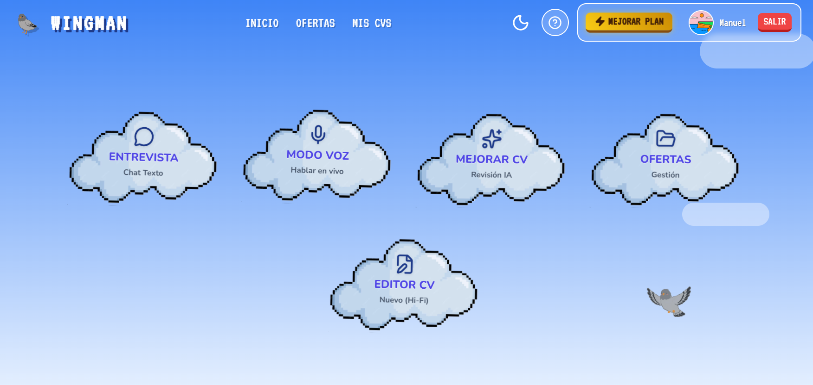
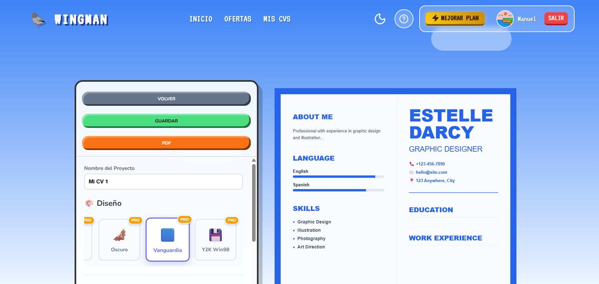
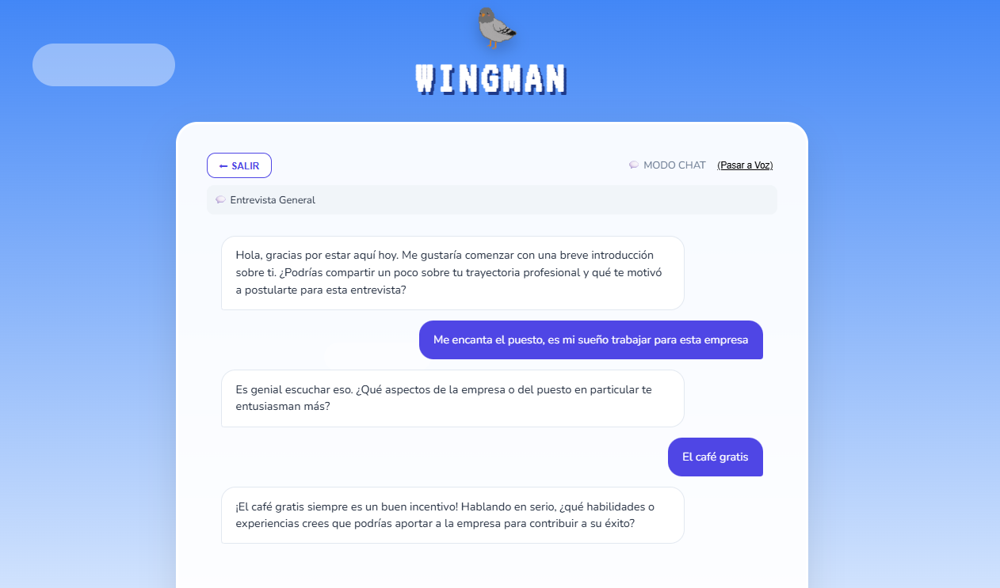

# Wingman 🐦 | Tu Copiloto Laboral con IA


*Tu centro de operaciones para la búsqueda de empleo*

**Wingman** es una aplicación inteligente diseñada para revolucionar tu búsqueda de empleo. Integra herramientas avanzadas de Inteligencia Artificial para optimizar tu CV, prepararte para entrevistas y gestionar ofertas de trabajo en un solo lugar.

## 🚀 Características Principales

### 📄 Editor de CV Inteligente

*   **Edición en Tiempo Real**: Visualiza los cambios de tu currículum al instante.
*   **Estructura JSON**: Gestión de datos robusta y portátil.
*   **Diseño Profesional**: Plantillas limpias y optimizadas para ATS.

### 🎙️ Modo Entrevista Inmersivo

*   **Simulador de Voz**: Practica entrevistas con un avatar de IA (`Paloma`) que habla y escucha.
*   **Feedback Instantáneo**: Recibe consejos sobre tus respuestas al momento.
*   **Contexto Adaptable**: Entrevistas generales o específicas para una oferta de trabajo concreta.

### 💼 Tablón de Empleos
*   **Gestión de Ofertas**: Sube y organiza las ofertas de trabajo que te interesan.
*   **Análisis Automático**: La IA analiza la oferta y te dice cómo encaja con tu perfil.

## 🛠️ Tecnologías

*   **Frontend**: React.js
*   **IA**: OpenAI GPT-4o-mini (API)
*   **Voz**: Web Speech API (Synthesis & Recognition)
*   **Estilos**: CSS Modules & Modern UI
*   **Persistencia**: LocalStorage

## 📦 Instalación y Uso

1.  **Clonar el repositorio**:
    ```bash
    git clone https://github.com/manuelmarcanoc/wingman.git
    cd wingman
    ```

2.  **Instalar dependencias**:
    ```bash
    npm install
    ```

3.  **Configurar Variables de Entorno**:
    Crea un archivo `.env` en la raíz del proyecto y añade tu clave de OpenAI:
    ```env
    REACT_APP_OPENAI_API_KEY=sk-tu-clave-aqui...
    ```

4.  **Arrancar la aplicación**:
    ```bash
    npm start
    ```
    Abre [http://localhost:3000](http://localhost:3000) en tu navegador.

## 🤝 Contribución

¡Las contribuciones son bienvenidas! Si tienes una idea para mejorar Wingman:

1.  Haz un Fork del proyecto.
2.  Crea una rama para tu "feature" (`git checkout -b feature/nueva-funcionalidad`).
3.  Haz Commit de tus cambios (`git commit -m 'Añadir nueva funcionalidad'`).
4.  Haz Push a la rama (`git push origin feature/nueva-funcionalidad`).
5.  Abre un Pull Request.
